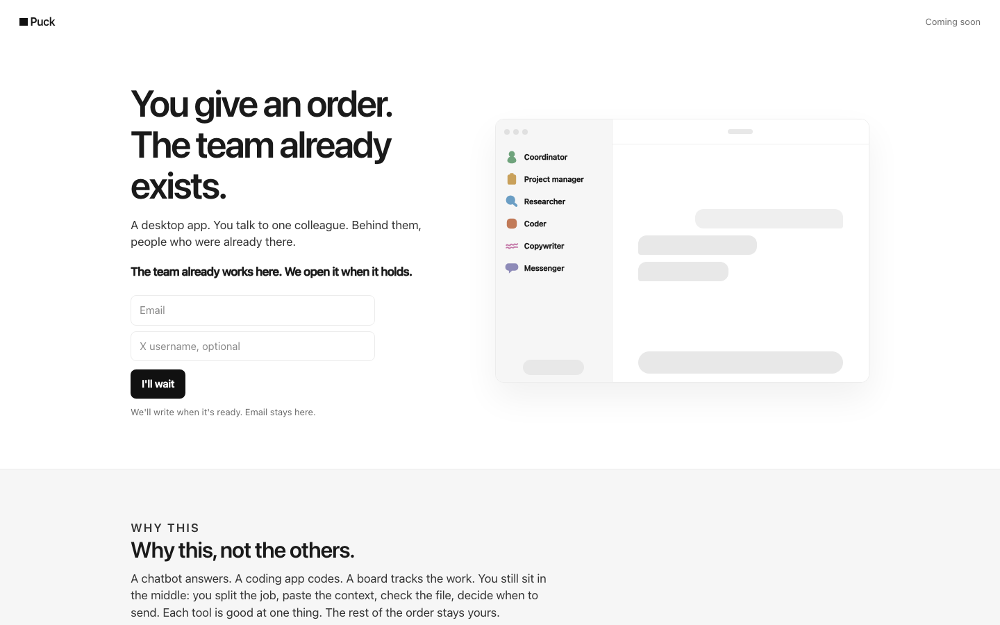

# Puck

*You give an order. The staff already exists.*

Puck is a desktop app for macOS: an **AI staff that works in your own folders**. An orchestrator (the Coordinator) runs the staff — today a Coder, and can open more coordinators. You talk to it like a colleague, not like a prompt box.



**Status: v0.0.2.** Working product, built by one person. macOS only. Needs your own API keys (see `.env.example`). Not a SaaS yet — [askpuck.app](https://askpuck.app) is the public site, with a waitlist.

## What's inside

- **Coordinator** — plans the job, wakes the Coder when it needs one, reports. Keeps a single chat, one work at a time.
- **Coder** — reads and writes files in the folder you pick (network and git allowed, commands auto and jailed to the workspace), generates images (Nano Banana 2 Fast), and opens its own page to check desktop and phone views.

Two roles today. The Coordinator asks you one question at a time when the job truly needs it, and the crew updates a shared memory file before every handoff.

## Quick start

Needs **Node** and **Rust** (Tauri 2).

```bash
npm install
cp .env.example .env      # add DEEPSEEK_API_KEY (+ NANOGPT_API_KEY for images)
npm run tauri dev
```

Pick a folder, give an order. That's it. The crew talks to DeepSeek
`deepseek-v4-flash-vision-exp` (official API, thinking on) by default;
`PUCK_CHAT=nano|openrouter|google` switches providers. The Coder can
see images (screenshots, references) and generates them via NanoGPT.

## Layout

- `src-tauri/` — the Rust/Tauri app (window, providers, tool loop, workspace jail)
- `src/` + `index.html` — the web UI (two columns: staff, chat)
- `crew/` — the standing orders for each role (read at runtime)
- `context/` — your chats and summaries, on disk, gitignored

The askpuck.app landing and waitlist live in their own deployment; this repository is the app.

## Rules that hold

- `.env` is never committed — keys are per-install (DeepSeek by default, NanoGPT for images; optional Google/OpenRouter).
- The Coder works in the folder you choose; private paths (SSH, AWS, …) stay closed.
- A job is not done until it landed on disk.

## License

**Proprietary.** This repository is a showcase, not open source. All rights reserved © 2026 Mattia Maggioni. See [LICENSE](LICENSE) — reading is welcome, reuse is not.
